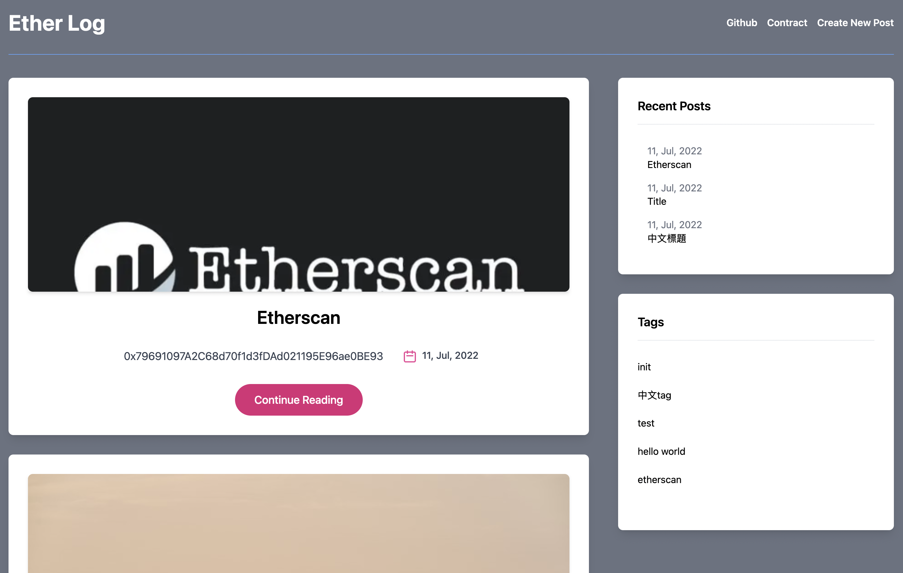
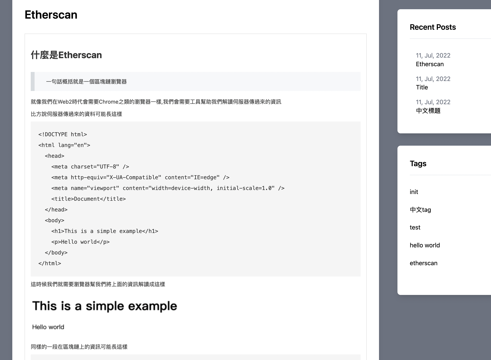
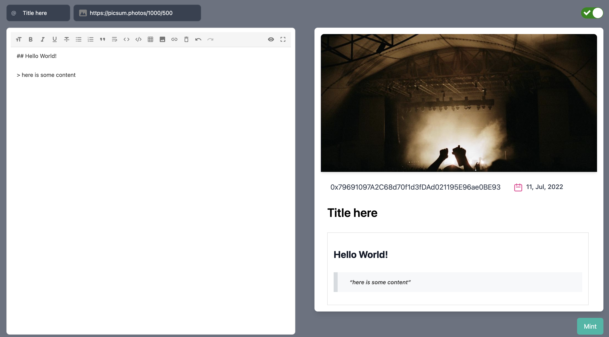
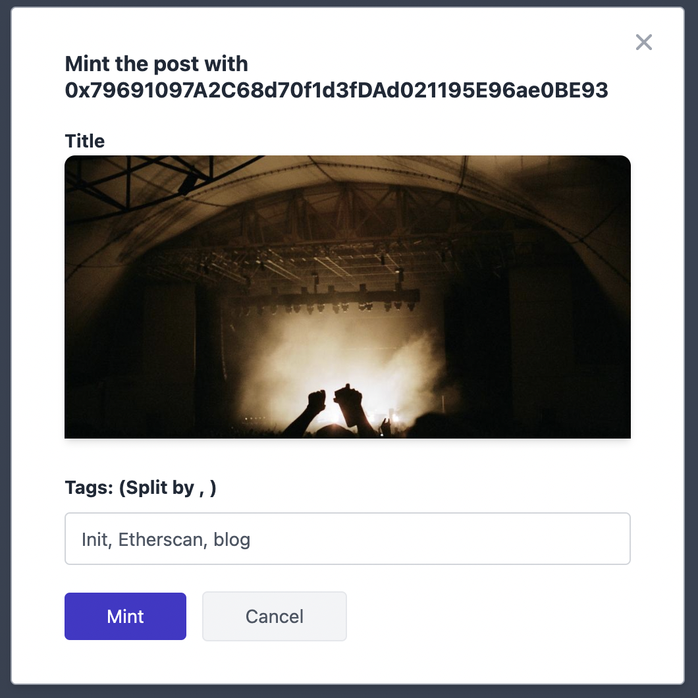
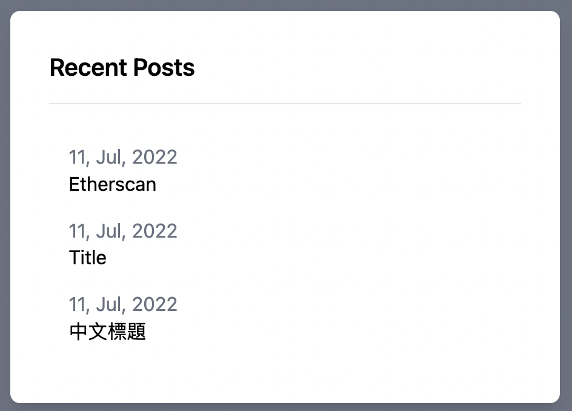
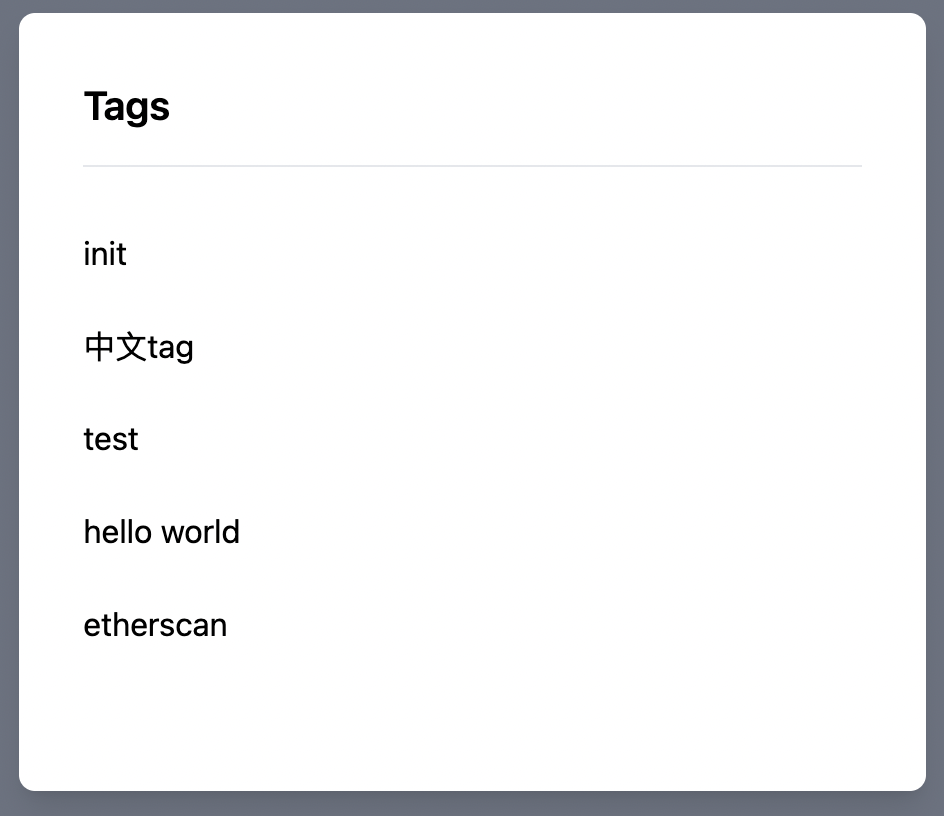

# Ether Log

[Link](https://web3-blog-remix.vercel.app/posts)

## Github

- [Contract](https://github.com/skynocover/web3_blog_contract)
- [Website](https://github.com/skynocover/web3_blog_remix)

## Technical

### Frontend
 
- [Remix run](https://remix.run/) (with typescript)
  - Use both SSR and CSR
- [tailwind](https://tailwindcss.com/)
- [ethers](https://docs.ethers.io/v5/)

### Contract

- [ERC721](https://eips.ethereum.org/EIPS/eip-721)
- [Hardhat](https://hardhat.org/)

### HardWard (Deploy)

- [Vercel](https://vercel.com)

## Characteristic

### Posts

> Use SSR so readers don't need to install Metamask, for SEO as well

### New Post

- Set cover by url
- Write the content with markdown

- set tag by author

### Recent posts / Tags

> Use CSR because SEO is no need here

- Pick recentest post
  - pick most 5 posts here

- List all tag here
  - tag will lead to posts which have been tag

